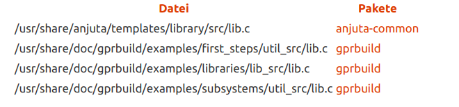
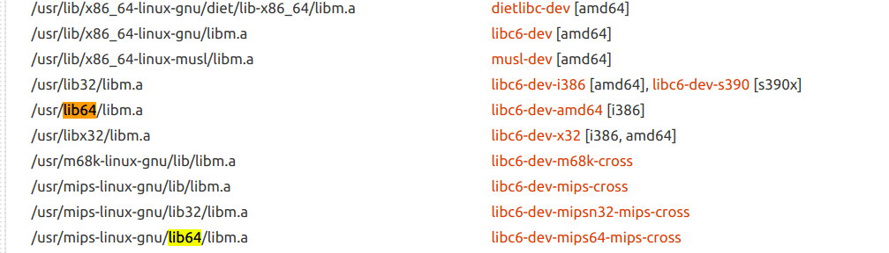

7.13

A.

    whereis lib.c
    lib: /usr/local/lib /usr/src/linux-headers-4.10.0-37-generic/lib /usr/src/linux-headers-4.10.0-37/lib /usr/src/linux-headers-4.10.0-28-generic/lib /usr/src/linux-headers-4.10.0-28/lib
    
    whereis libm.a
    libm:

发现没有相应的文件，因此用`apt-file`查询

    sudo apt-get install apt-file
    sudo apt-file upgdate
    apt-file search libm.a
    apt-file search libm.so

也可以到_paste.ubunut.com_查询。

这是从Ubuntu仓库查询到的结果:  

[libm.a](https://packages.ubuntu.com/search?mode=exactfilename&suite=artful&section=all&arch=any&keywords=libm.a&searchon=contents)

用`apt-get`安装好相应的软件包后:

    whereis libm.a
    libm: /usr/lib64/libm.a /usr/lib64/libm.so
 
    ar t /usr/lib64/libm.a
    
输出为:

    s_lib_version.o
    s_matherr.o
    s_signgam.o
    fclrexcpt.o
    fgetexcptflg.o
    fraiseexcpt.o
    fsetexcptflg.o
    ftestexcept.o
    fegetround.o
    fesetround.o
    fegetenv.o
    feholdexcpt.o
    fesetenv.o
    feupdateenv.o
    t_exp.o
    fedisblxcpt.o
    feenablxcpt.o
    fegetexcept.o
    powl_helper.o
    e_acos.o
    e_acosh.o
    e_asin.o
    e_atan2.o
    e_atanh.o
    e_cosh.o
    e_exp.o
    e_fmod.o
    e_hypot.o
    e_j0.o
    e_j1.o
    e_jn.o
    e_lgamma_r.o
    e_log.o
    e_log10.o
    e_pow.o
    e_rem_pio2.o
    e_remainder.o
    e_scalb.o
    e_sinh.o
    e_sqrt.o
    e_gamma_r.o
    e_ilogb.o
    k_cos.o
    k_rem_pio2.o
    k_sin.o
    k_tan.o
    s_asinh.o
    s_atan.o
    s_cbrt.o
    s_ceil.o
    s_cos.o
    s_erf.o
    s_expm1.o
    s_fabs.o
    s_floor.o
    s_log1p.o
    w_log1p.o
    s_logb.o
    s_nextafter.o
    s_nexttoward.o
    s_rint.o
    s_scalbln.o
    w_scalbln.o
    s_significand.o
    s_sin.o
    s_tan.o
    s_tanh.o
    w_acos.o
    w_acosh.o
    w_asin.o
    w_atan2.o
    w_atanh.o
    w_cosh.o
    w_exp.o
    w_exp2.o
    w_exp10.o
    w_fmod.o
    w_tgamma.o
    w_hypot.o
    w_j0.o
    w_j1.o
    w_jn.o
    w_lgamma.o
    w_lgamma_r.o
    w_log.o
    w_log10.o
    w_pow.o
    w_remainder.o
    w_scalb.o
    w_sinh.o
    w_sqrt.o
    w_ilogb.o
    s_fpclassify.o
    s_fmax.o
    s_fmin.o
    s_fdim.o
    s_nan.o
    s_trunc.o
    s_remquo.o
    e_log2.o
    e_exp2.o
    s_round.o
    s_nearbyint.o
    s_sincos.o
    conj.o
    cimag.o
    creal.o
    cabs.o
    carg.o
    s_cexp.o
    s_csinh.o
    s_ccosh.o
    s_clog.o
    s_catan.o
    s_casin.o
    s_ccos.o
    s_csin.o
    s_ctan.o
    s_ctanh.o
    s_cacos.o
    s_casinh.o
    s_cacosh.o
    s_catanh.o
    s_csqrt.o
    s_cpow.o
    s_cproj.o
    s_clog10.o
    s_fma.o
    s_lrint.o
    s_llrint.o
    s_lround.o
    s_llround.o
    e_exp10.o
    w_log2.o
    s_issignaling.o
    m_isinf.o
    m_isnan.o
    m_finite.o
    m_copysign.o
    m_modf.o
    m_scalbn.o
    m_frexp.o
    m_ldexp.o
    m_signbit.o
    x2y2m1.o
    k_casinh.o
    gamma_product.o
    k_standard.o
    lgamma_neg.o
    lgamma_product.o
    w_lgamma_compat.o
    e_acosf.o
    e_acoshf.o
    e_asinf.o
    e_atan2f.o
    e_atanhf.o
    e_coshf.o
    e_expf.o
    e_fmodf.o
    e_hypotf.o
    e_j0f.o
    e_j1f.o
    e_jnf.o
    e_lgammaf_r.o
    e_logf.o
    e_log10f.o
    e_powf.o
    e_rem_pio2f.o
    e_remainderf.o
    e_scalbf.o
    e_sinhf.o
    e_sqrtf.o
    e_gammaf_r.o
    e_ilogbf.o
    k_cosf.o
    k_rem_pio2f.o
    k_sinf.o
    k_tanf.o
    s_asinhf.o
    s_atanf.o
    s_cbrtf.o
    s_ceilf.o
    s_cosf.o
    s_erff.o
    s_expm1f.o
    s_fabsf.o
    s_floorf.o
    s_log1pf.o
    w_log1pf.o
    s_logbf.o
    s_nextafterf.o
    s_nexttowardf.o
    s_rintf.o
    s_scalblnf.o
    w_scalblnf.o
    s_significandf.o
    s_sinf.o
    s_tanf.o
    s_tanhf.o
    w_acosf.o
    w_acoshf.o
    w_asinf.o
    w_atan2f.o
    w_atanhf.o
    w_coshf.o
    w_expf.o
    w_exp2f.o
    w_exp10f.o
    w_fmodf.o
    w_tgammaf.o
    w_hypotf.o
    w_j0f.o
    w_j1f.o
    w_jnf.o
    w_lgammaf.o
    w_lgammaf_r.o
    w_logf.o
    w_log10f.o
    w_powf.o
    w_remainderf.o
    w_scalbf.o
    w_sinhf.o
    w_sqrtf.o
    w_ilogbf.o
    s_fpclassifyf.o
    s_fmaxf.o
    s_fminf.o
    s_fdimf.o
    s_nanf.o
    s_truncf.o
    s_remquof.o
    e_log2f.o
    e_exp2f.o
    s_roundf.o
    s_nearbyintf.o
    s_sincosf.o
    conjf.o
    cimagf.o
    crealf.o
    cabsf.o
    cargf.o
    s_cexpf.o
    s_csinhf.o
    s_ccoshf.o
    s_clogf.o
    s_catanf.o
    s_casinf.o
    s_ccosf.o
    s_csinf.o
    s_ctanf.o
    s_ctanhf.o
    s_cacosf.o
    s_casinhf.o
    s_cacoshf.o
    s_catanhf.o
    s_csqrtf.o
    s_cpowf.o
    s_cprojf.o
    s_clog10f.o
    s_fmaf.o
    s_lrintf.o
    s_llrintf.o
    s_lroundf.o
    s_llroundf.o
    e_exp10f.o
    w_log2f.o
    s_issignalingf.o
    m_isinff.o
    m_isnanf.o
    m_finitef.o
    m_copysignf.o
    m_modff.o
    m_scalbnf.o
    m_frexpf.o
    m_ldexpf.o
    m_signbitf.o
    x2y2m1f.o
    k_casinhf.o
    gamma_productf.o
    k_standardf.o
    lgamma_negf.o
    lgamma_productf.o
    w_lgamma_compatf.o
    e_acosl.o
    e_acoshl.o
    e_asinl.o
    e_atan2l.o
    e_atanhl.o
    e_coshl.o
    e_expl.o
    e_fmodl.o
    e_hypotl.o
    e_j0l.o
    e_j1l.o
    e_jnl.o
    e_lgammal_r.o
    e_logl.o
    e_log10l.o
    e_powl.o
    e_rem_pio2l.o
    e_remainderl.o
    e_scalbl.o
    e_sinhl.o
    e_sqrtl.o
    e_gammal_r.o
    e_ilogbl.o
    k_cosl.o
    k_rem_pio2l.o
    k_sinl.o
    k_tanl.o
    s_asinhl.o
    s_atanl.o
    s_cbrtl.o
    s_ceill.o
    s_cosl.o
    s_erfl.o
    s_expm1l.o
    s_fabsl.o
    s_floorl.o
    s_log1pl.o
    w_log1pl.o
    s_logbl.o
    s_nextafterl.o
    s_nexttowardl.o
    s_rintl.o
    s_scalblnl.o
    w_scalblnl.o
    s_significandl.o
    s_sinl.o
    s_tanl.o
    s_tanhl.o
    w_acosl.o
    w_acoshl.o
    w_asinl.o
    w_atan2l.o
    w_atanhl.o
    w_coshl.o
    w_expl.o
    w_exp2l.o
    w_exp10l.o
    w_fmodl.o
    w_tgammal.o
    w_hypotl.o
    w_j0l.o
    w_j1l.o
    w_jnl.o
    w_lgammal.o
    w_lgammal_r.o
    w_logl.o
    w_log10l.o
    w_powl.o
    w_remainderl.o
    w_scalbl.o
    w_sinhl.o
    w_sqrtl.o
    w_ilogbl.o
    s_fpclassifyl.o
    s_fmaxl.o
    s_fminl.o
    s_fdiml.o
    s_nanl.o
    s_truncl.o
    s_remquol.o
    e_log2l.o
    e_exp2l.o
    s_roundl.o
    s_nearbyintl.o
    s_sincosl.o
    conjl.o
    cimagl.o
    creall.o
    cabsl.o
    cargl.o
    s_cexpl.o
    s_csinhl.o
    s_ccoshl.o
    s_clogl.o
    s_catanl.o
    s_casinl.o
    s_ccosl.o
    s_csinl.o
    s_ctanl.o
    s_ctanhl.o
    s_cacosl.o
    s_casinhl.o
    s_cacoshl.o
    s_catanhl.o
    s_csqrtl.o
    s_cpowl.o
    s_cprojl.o
    s_clog10l.o
    s_fmal.o
    s_lrintl.o
    s_llrintl.o
    s_lroundl.o
    s_llroundl.o
    e_exp10l.o
    w_log2l.o
    s_issignalingl.o
    m_isinfl.o
    m_isnanl.o
    m_finitel.o
    m_copysignl.o
    m_modfl.o
    m_scalbnl.o
    m_frexpl.o
    m_ldexpl.o
    m_signbitl.o
    x2y2m1l.o
    k_casinhl.o
    gamma_productl.o
    k_standardl.o
    lgamma_negl.o
    lgamma_productl.o
    w_lgamma_compatl.o
    t_sincosl.o
    k_sincosl.o
    branred.o
    doasin.o
    dosincos.o
    halfulp.o
    mpa.o
    mpatan2.o
    mpatan.o
    mpexp.o
    mplog.o
    mpsqrt.o
    mptan.o
    sincos32.o
    slowexp.o
    slowpow.o
    sincostab.o
    s_floor-c.o
    s_ceil-c.o
    s_floorf-c.o
    s_ceilf-c.o
    s_rint-c.o
    s_rintf-c.o
    s_nearbyint-c.o
    s_nearbyintf-c.o
    e_exp-fma4.o
    e_log-fma4.o
    e_pow-fma4.o
    s_atan-fma4.o
    e_asin-fma4.o
    e_atan2-fma4.o
    s_sin-fma4.o
    s_tan-fma4.o
    mplog-fma4.o
    mpa-fma4.o
    slowexp-fma4.o
    slowpow-fma4.o
    sincos32-fma4.o
    doasin-fma4.o
    dosincos-fma4.o
    halfulp-fma4.o
    mpexp-fma4.o
    mpatan2-fma4.o
    mpatan-fma4.o
    mpsqrt-fma4.o
    mptan-fma4.o
    e_exp-avx.o
    e_log-avx.o
    s_atan-avx.o
    e_atan2-avx.o
    s_sin-avx.o
    s_tan-avx.o
    mplog-avx.o
    mpa-avx.o
    slowexp-avx.o
    mpexp-avx.o

B.

    (cd ./code/7.13; make; make da)

输出为:

    gcc -o Og-test -Og test.c 
    gcc -o Og-g-test -Og -g test.c
    objdump -d Og-test > diff1
    objdump -d Og-g-test > diff2
    diff diff1 diff2;[ $? -eq 1 ]
    2c2
    < Og-test:     file format elf64-x86-64
    ---
    > Og-g-test:     file format elf64-x86-64

没有区别

C.

    ldd Og-test 
    
    linux-vdso.so.1 =>  (0x00007ffd24ffc000)
    libc.so.6 => /lib/x86_64-linux-gnu/libc.so.6 (0x00007f2c6b996000)
    /lib64/ld-linux-x86-64.so.2 (0x000056119ce6d000)

