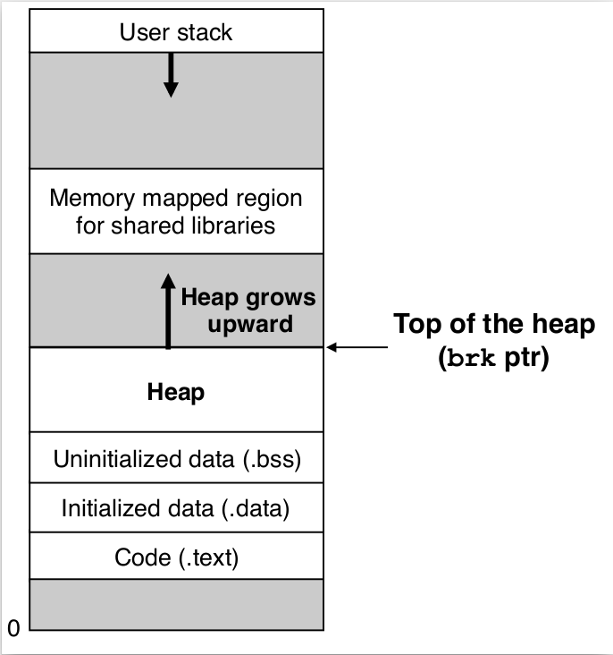

### 2.1 动态内存分配器的基本原理

程序运行时可以用动态内存分配器（dynamic memory allocator）来申请额外的虚拟内存，它比`mmap`和`munmap`函数更方便，也具有更好的可移植性。  

动态内存分配器维护着一个进程的虚拟内存区域，称为**堆**(heap)：  

||
|:--:|
|*heap*|

假设堆是一个请求二进制零的区域，它紧接在未初始化的数据（.bss）后开始，并向上（更高的地址）生长。对于每个进程，内核维护着一个变量`brk`，它指向堆的顶部。  

分配器将堆视为一组不同大小的**块**（block）的集合来维护。每个块就是一个连续的**虚拟内存片**（chunk），有**已分配**和**空闲**两种状态：  
1. 已分配    
    已分配的块能被应用程序使用，被释放后变为空闲状态。释放可由应用程序显式（explicitly）执行或者内存分配器隐式（implicitly）执行。  
2. 空闲  
    空闲的块可用来分配，被分配后变为已分配状态。  

分配器有两种基本类型，都要求应用显式地分配块，但区别在于谁来释放已分配的块：  
1. 显示分配器（explicit allocator）   
    应用显式地释放已分配的块。  
    例如：C中与`malloc`对应的`free`，C++中与`new`对应的`delete`。  
2. 隐式分配器（implicit allocator）  
    分配器检测到已分配的块不再被程序使用时释放这个块。  
    又称**垃圾收集器**（garbage collector），释放过程称为**垃圾收集**（garbage collection）。  

