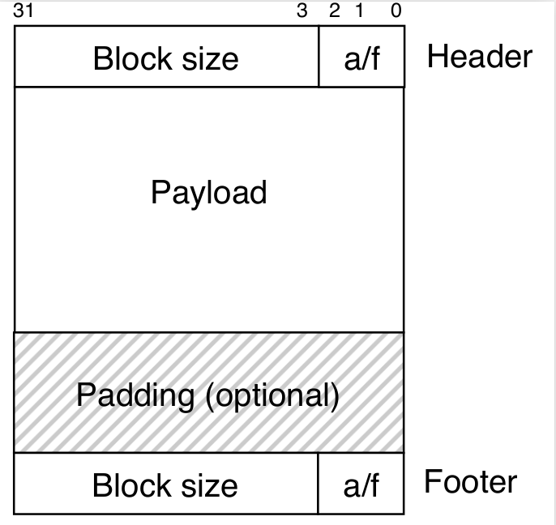
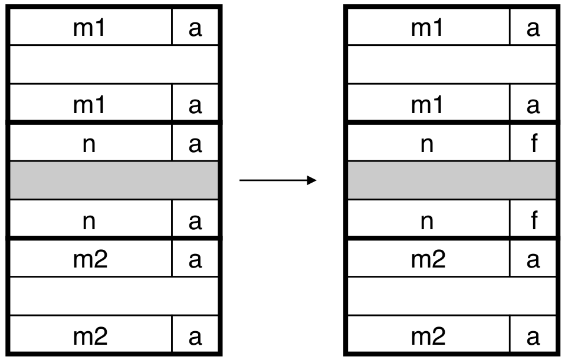
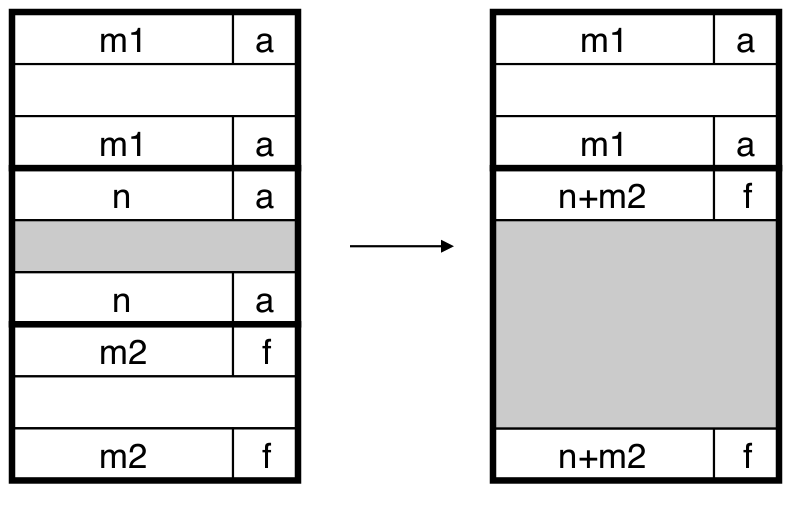
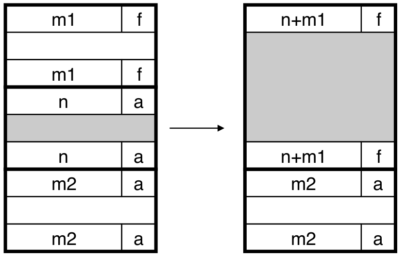
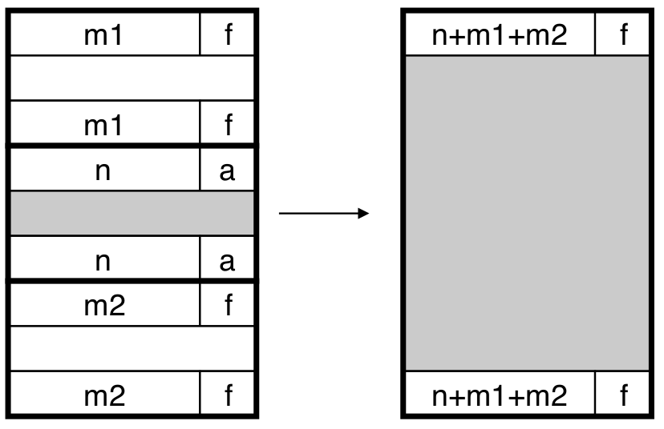

### 2.2 带边界标记的隐式空闲链表分配器原理

简单的隐式空闲链表在合并空闲块时，当前块的头部指向下一个块的头部，这样当前块和下一个块可以在常数时间内合并。但是合并前面的块需要搜索整个链表，记住前面的位置，直到到达当前块，这意味着`free`的时间复杂度与堆的大小呈线性关系。  
Knuth提出的**边界标记**（boundary tag）技术允许在常数时间内进行对前面块的合并。

||
|:--:|
|*带边界标记的隐式空闲链表的堆块格式*|

它由以下几个部分组成：  
1. 头部  
    表示块大小（包括头部和所有的填充），由于需要满足8字节对齐的约束条件，块的大小必定是8的倍数。因此头部共32位，最低3位必为0，可以用这3位中的最低位来表示已分配或者空闲。  
2. 有效载荷（已分配的块才有）  
    表示可用的空间。  
3. 填充  
    为满足对齐要求而增加的空间。  
4. 尾部  
    脚部就是头部的一个副本。分配器可以通过检查脚部判段前面一个块的起始位置和状态。前一块的脚部在当前块开始处前的4字节（32位、1个字）处。  
  
分配器释放当前块时，有以下四种情况，a代表allocated（已分配），f代表free（空闲），当前块为中间大小为n的块：  
1. 前后的块都已分配  
    
    ||
    |:--:|
    |*情况1*|
    
    这种情况下不能进行合并。  
2. 前面的块已分配，后面的块空闲  
    
    ||
    |:--:|
    |*情况2*|
    
    当前块与后面的块进行合并。用当前块和后面的块的大小来更新当前块的头部和后面块的脚部。  
3. 前面的块空闲，后面的块已分配  

    ||
    |:--:|
    |*情况3*|
    
    当前块与前面的块进行合并。用当前块和前面的块的大小来更新前面块的头部和当前块的脚部。  
4. 前面和后面的块都空闲  
    
    ||
    |:--:|
    |*情况4*|
    
    合并三个块，用合并后的大小来更新前面块的头部和后面块的脚部。  

这个技术的缺点是要求每个块都保持一个头部和尾部，当程序操作许多小块时，会产生显著的内存开销。  
有一种方法可以使已分配块中不再需要脚部。在上面4个例子中，只有前面块为空闲时，前面块的脚部才起作用。因此，若前面的块已分配，可以将前面的块的脚部省去，但要把前面的块的已分配/空闲位存放在当前块多出来的低位中。  

