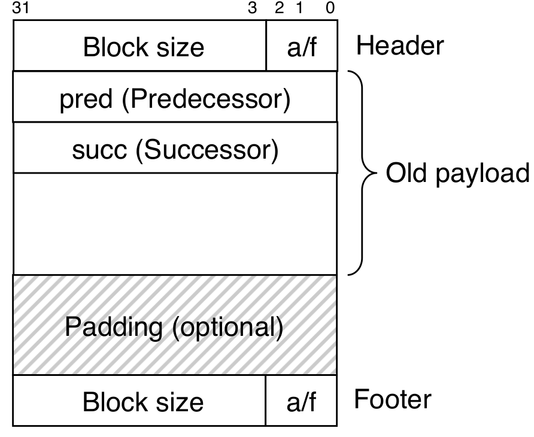

### 2.3 显示空闲链表的基本原理

隐式空闲链表块分配与堆块的总数呈线性关系，因此不适用于通用的分配器。  

显示空闲链表（explicit free list）将空闲块组织为某种形式的显式数据结构。由于程序不需要空闲块的主体，可以在这个区域存放指针。  
例如，堆可以组织为双向空闲链表，每个空闲块包含1个pred（predecessor）和succ（successor）指针，如下图所示：  

||
|:--:|
|*双向空闲链表空闲块堆块格式*|

使用双向链表可以使**首次适配**（first-fit allocation）的分配时间从*块总数*的线性时间减少到*空闲块总数*线性时间。不过释放一个块的时间可以是线性的，也可能是常数，这取决于空闲链表中块的排序策略。  

1. 后进先出（LIFO）  
    将新释放的块放置在链表的开始处。分配器最先检查最近使用过的块，释放一个块可以在*常数时间*内完成，如果使用了边界标记，合并也可以在*常数时间*内完成。  
2. 地址顺序（address order）  
    链表中每个块的地址都小于其后继的地址。释放一个块需要*线性时间*的搜索来定位合适的前驱，如果使用了边界标记，合并可以在*常数时间*内完成。  
    
按照地址排序的首次适配释放虽然比后进先出更慢，但有更高的内存利用率，接近最佳适配的利用率。  

显示链表也有缺点，空闲块必须足够大以包含所有需要的指针、头部和可能的脚部。因此最小块大小增大，潜在地增加了内部碎片。  

