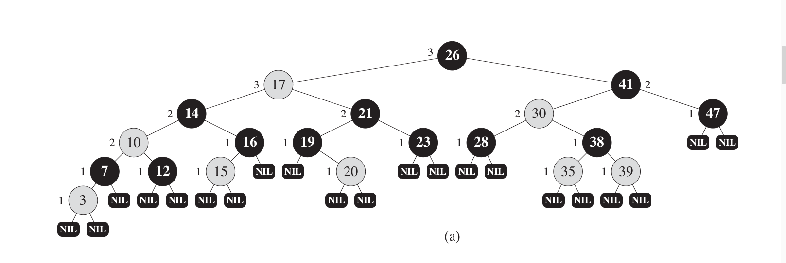

### 2.4 红黑树的结构、查找、更新算法

**红黑树**（red-black tree）是一种平衡的搜索树，可以保证最坏的情况下查找、得到前驱、后继、最大值、最小值、插入、删除的时间复杂度为O(log n)。

#### 2.4.1 红黑树的结构

红黑树的每个结点在二叉搜索树的基础上增加了一个额外的位来表示结点的**颜色**（红、黑）。红黑树上所有从根到叶的路没有一条超过另一条的两倍，因此可以近似认为是平衡的。  
每个结点包含*颜色*、*关键字*、*左孩子*、*右孩子*和*父亲*这几项。如果相应的孩子或父亲不存在，用NULL表示。我们将NULL看作指向叶子的指针，有关键字的结点看作内部节点。  
红黑树的性质如下：  
1. 每个结点非红即黑
2. 根结点是黑色的
3. 每个叶子（NULL）都是黑色的
4. 如果一个节点是红色的，那么它的两个孩子都是黑色的
5. 每个结点到所有叶子的简单路径上的黑色结点数相同

||
|:--:|
|*红黑树*|

#### 2.4.2 红黑树的查找

红黑树是特殊的二叉查找树，每个结点左孩子较它本身小，右孩子较它本身大，因此很容易写出递归地查找算法`search`：

1. 若为NULL，返回未查询到。
2. 如果要查找的值较当前值小，调用`search`查找左子树。
3. 如果要查找的值较当前值大，调用`search`查找右子树。
4. 如果要查找的值等于当前值，查找成功，返回。

#### 2.4.3 红黑树的更新

红黑树在二叉查找树插入的基础上，加入了恢复平衡的插入修复操作。
* 如果插入的是根结点，直接把此结点涂为黑色。
* 如果插入的结点的父结点是黑色，由于此不会违反性质2和性质4，红黑树没有被破坏，所以此时也是什么也不做。
* 插入修复情况1：如果当前结点的父结点是红色且祖父结点的另一个子结点（叔叔结点）是红色  
    此时父结点的父结点一定存在，否则插入前就已不是红黑树。  
    与此同时，又分为父结点是祖父结点的左子还是右子，对于对称性，我们只要讨论一种情况就可以了。  
    
    在此，我们只考虑父结点为祖父左子的情况。  
    同时，还可以分为当前结点是其父结点的左子还是右子，但是处理方式是一样的。我们将此归为同一类。  
    
    将当前结点的父结点和叔叔结点涂黑，祖父结点涂红，把当前结点指向祖父结点，从新的当前结点重新开始算法。  
    
* 插入修复情况2：当前结点的父结点是红色,叔叔结点是黑色，当前结点是其父结点的右子  
    
    当前结点的父结点做为新的当前结点，以新当前结点为支点左旋。  
    
* 插入修复情况3：当前结点的父结点是红色,叔叔结点是黑色，当前结点是其父结点的左子  

    父结点变为黑色，祖父结点变为红色，在祖父结点为支点右旋    

