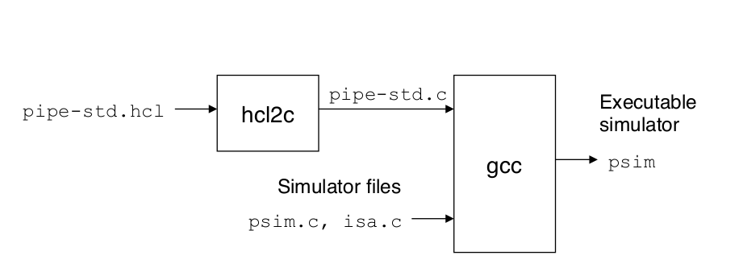
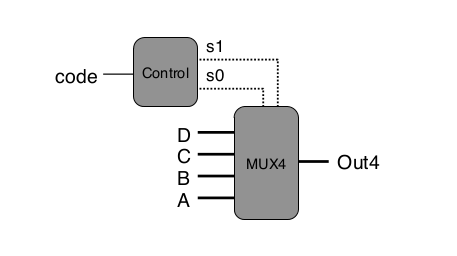

### 3.1 理解HCL语言

HCL（Hardware Control Language）语言是CSAPP开发的，从[CSAPP网站](www.csapp.cs.cmu.edu)可以获得，网络旁注waside-hcl介绍了它的使用。

#### 3.1.1 库文件

文件目录：

    code/misc


1. 生成`hcl2c`和`hcl2v`转换程序
    + `hcl.lex`

        利用`flex`生成`lex.yy.c`

    + `hcl.y`

        利用`bison`生成`hcl.tab.c`、`hcl.tab.h`

    + `node.h`、`node.c`

        从HCL生成C或Verilog的函数定义和实现

    + `outgen.h`、`outgen.h`

        输出生成器，保证每一行的列数不超标。

2. 生成`yas`和`yis`汇编器、模拟器
    + `isa.h`

        Instruction Set definition for Y86-64 Architecture  
        即Y86-64的数据类型、基本功能函数定义。所有课本中的变量类型都在这两个文件中定义好了。  
        `isa.h`中定义了寄存器、参数类型、指令类型、ALU操作、功能码、跳转条件、指令结构体、内存操作、ISA实现等等。
        
        先读懂这部分的代码才能继续进行下一步。  
        `isa.h`中定义的变量类型有：  
        
        |`reg_id_t`|`arg_t` |`itype_t`|`alu_t`    |
        |----------|--------|---------|-----------|
        |寄存器ID  |参数类型|指令类型 |ALU操作类型|
        |`fun_t`   |`cond_t`|`bool_t`|`instr_t`、`instr_ptr` |
        |默认操作码|条件跳转|布尔类型|指令结构体及其指针     |
        |`byte_t`|`word_t` |`uword_t`       |`mem_rec`、`mem_t`|
        |字节    |long long|无符号的`word_t`|内存及其指针      |
        |`cc_t`    |`stat_t`|`state_rec`、`state_ptr`|
        |条件码类型|状态类型|状态结构体及其指针      |

        `isa.h`中定义的函数有：  
        
        |`find_register`   |`reg_name`        |`op_name`            |`iname`             |`find_str`          |
        |------------------|------------------|---------------------|--------------------|--------------------|
        |由寄存器名字得到ID|由寄存器ID得到名字|由`alu_t`得到操作名字|由指令字节得到指令码|由指令得到指令结构体|
        |`bad_instr`           |`init_mem`|`clear_mem`|`copy_mem`|`diff_mem`      |
        |返回非法指令以处理错误|申请内存  |内存置零   |复制内存  |打印两段内存区别|
        |`load_mem` |`get_byte_val`|`get_word_val`|`set_byte_val`|`set_word_val`|
        |从`.yo`加载|从内存读字节  |从内存读字    |设置内存字节  |设置内存字    |
        |`dump_memory`|`init_reg`      |`copy_reg`    |`get_reg_val`|`set_reg_val`|
        |打印内存信息 |初始化寄存器文件|复制寄存器文件|读寄存器文件 |写寄存器文件 |
        |`dump_reg`        |`compute_alu`|`compute_cc`|`cc_name`   |`stat_name`   |
        |打印寄存器文件信息|执行计算操作 |计算条件码  |CC转为字符串|状态转为字符串|
        |`new_state`|`free_state`|`copy_state`|`cond_holds`    |`step_state`|
        |新建状态   |删除状态    |复制状态    |判断条件是否满足|单步执行    |
        
    + `isa.c`

        `isa.c`是`isa.h`中定义的函数实现过程。

下图是CSAPP网络旁注waside-hcl中的图片，说明了PIPE的HCL实现原理：

    
理解好了这个库之后，下一步只需要写出PIPE的HCL代码，利用`hcl2c`将其转换为C代码，再和`isa.h`、`isa.c`、`psim.c`链接，利用`gcc`生成PIPE二进制程序即可。进一步还可以利用`hcl2v`产生PIPE的Verilog代码。

#### 3.1.2 HCL用法

课本中用不少篇幅讲解了HCL，同时waside-hcl中也提供了更详细的参考。

1. 信号定义

    |integer             |Boolean              |
    |--------------------|---------------------|
    |intsig name 'C-expr'|boolsig name 'C-expr'|

2. Quote文本

        quote 'string'

    `hcl2c`会直接把相应文本复制到C文件中，这个机制可以用来插入变量定义、`include`语句、其他C语言中常见的元素。

3. 表达式和块
    + 布尔表达式
    
        相比C语言，多出了集合成员测试（Set membership test）：
        
            int-expr in {int-expr 1 ,int-expr 2 , . . . ,int-expr k }
        
    + 整数表达式
    
        除了常数、自定义整数信号外，还有case表达式：
        
            [
                bool -expr 1
                bool -expr 2 :
                :
                .
                . int-expr 1
                int-expr 2
                bool -expr k : int-expr k
            ]
        
        课本上对case表达式有详细的讲解。

    + 组合逻辑
    
        块定义的方法如下，`hcl2c`为之生成函数`gen_name`，无形参、返回值为`int`：
        
            # 布尔块
            bool name = bool-expr ; 
            # 字级块
            int name = int-expr ;
        
#### 3.1.3 MUX4例子

对于下图的4路选择器，CSAPP给出了HCL代码：



```hcl
#/* $begin sim-mux4-raw-hcl */
## Simple example of an HCL file.
## This file can be converted to C using hcl2c, and then compiled.

## In this example, we will generate the MUX4 circuit shown in
## Section SLASHrefLBRACKsect:arch:hclsetRBRACK.  It consists of a control block that generates
## bit-level signals s1 and s0 from the input signal code,
## and then uses these signals to control a 4-way multiplexor
## with data inputs A, B, C, and D.

## This code is embedded in a C program that reads
## the values of code, A, B, C, and D from the command line
## and then prints the circuit output

## Information that is inserted verbatim into the C file
quote '#include <stdio.h>'
quote '#include <stdlib.h>'
quote 'long long code_val, s0_val, s1_val;'
quote 'char **data_names;'

## Declarations of signals used in the HCL description and
## the corresponding C expressions.
boolsig s0 's0_val'
boolsig s1 's1_val'
wordsig code 'code_val'
wordsig  A 'atoll(data_names[0])'
wordsig  B 'atoll(data_names[1])'
wordsig  C 'atoll(data_names[2])'
wordsig  D 'atoll(data_names[3])'

## HCL descriptions of the logic blocks
quote '/* $begin sim-mux4-s1-c */'
bool s1 = code in { 2, 3 };
quote '/* $end sim-mux4-s1-c */'

bool s0 = code in { 1, 3 };

word Out4 = [
	!s1 && !s0 : A;	# 00
	!s1        : B;	# 01
	!s0        : C;	# 10
	1          : D;	# 11
];

## More information inserted verbatim into the C code to
## compute the values and print the output
quote '/* $begin sim-mux4-main-c */'
quote 'int main(int argc, char *argv[]) {'
quote '  data_names = argv+2;'
quote '  code_val = atoll(argv[1]);'
quote '  s1_val = gen_s1();'
quote '  s0_val = gen_s0();'
quote '  printf("Out = %lld\n", gen_Out4());'
quote '  return 0;'
quote '}'
quote '/* $end sim-mux4-main-c */'
#/* $end sim-mux4-raw-hcl */
```

修改`Makefile`：
    
    mux4: mux4.hcl hcl2c
	    # Building the mux4 
	    ./hcl2c -n mux4.hcl < mux4.hcl > mux4.c
	    $(CC) $(CFLAGS) -o mux4 mux4.c 

可以看到生成了下面的`mux4.c`：

```c
char simname[] = "Y86-64 Processor: mux4.hcl";
#include <stdio.h>
#include <stdlib.h>
long long code_val, s0_val, s1_val;
char **data_names;
/* $begin sim-mux4-s1-c */
long long gen_s1()
{
    return ((code_val) == 2 || (code_val) == 3);
}

/* $end sim-mux4-s1-c */
long long gen_s0()
{
    return ((code_val) == 1 || (code_val) == 3);
}

long long gen_Out4()
{
    return ((!(s1_val) & !(s0_val)) ? (atoll(data_names[0])) : !(s1_val) ?
      (atoll(data_names[1])) : !(s0_val) ? (atoll(data_names[2])) :
      (atoll(data_names[3])));
}

/* $begin sim-mux4-main-c */
int main(int argc, char *argv[]) {
  data_names = argv+2;
  code_val = atoll(argv[1]);
  s1_val = gen_s1();
  s0_val = gen_s0();
  printf("Out = %lld\n", gen_Out4());
  return 0;
}
/* $end sim-mux4-main-c */

```

测试：

    linux> ./mux4 2 0 0 1 0
    Out = 1


